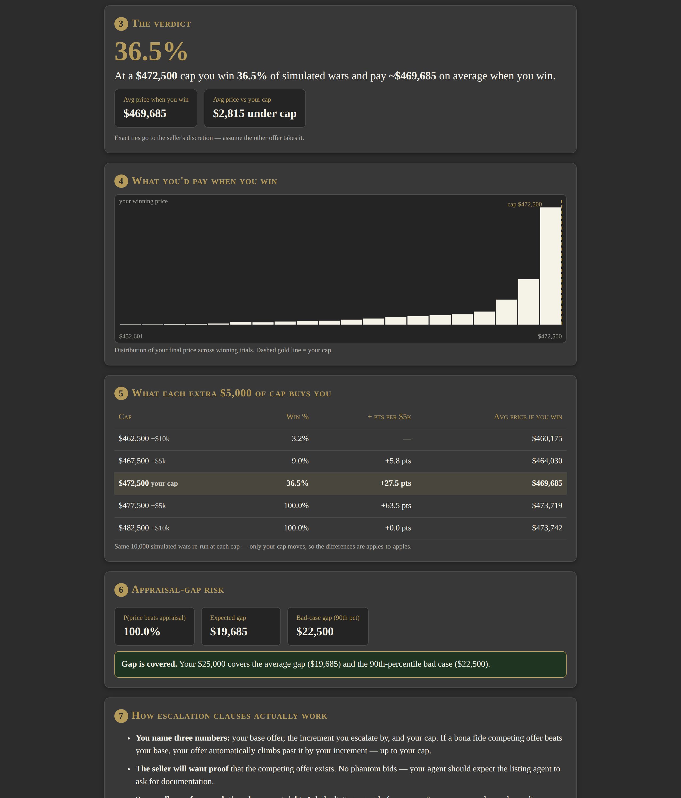

# Escalator — Bid-War Simulator

**Live:** https://thebullbrew.github.io/escalation-simulator/

A Monte Carlo bidding-war simulator for homebuyers (and their agents) writing offers with escalation clauses. Tell it the listing price, your cap, how many rivals you're up against, and how hot the market is — it fights 10,000 simulated bidding wars and tells you your odds.

## What it does

- **Win probability + expected price** — a big verdict line: *"At a $472,500 cap you win 36.5% of simulated wars and pay ~$469,685 on average when you win."*
- **Histogram of your winning price** — hand-rolled canvas chart with your cap marked as a dashed gold line.
- **Marginal table** — what each extra $5,000 of cap actually buys you in win-probability points (−$10k / −$5k / your cap / +$5k / +$10k, reusing the same 10,000 draws so the comparison is apples-to-apples).
- **Appraisal-gap risk** — probability your winning price beats the appraisal, expected gap dollars, 90th-percentile bad case, and a hard flag if your gap cash doesn't cover it.
- **Escalation-clause explainer** — plain-English card: bona fide competing offers, proof requirements, sellers who refuse escalation clauses, and why your visible cap is a double-edged sword.
- **Saveable scenarios** (localStorage) + one-click copyable text summary.

## The method behind it

Each of the 10,000 trials draws a field of competitors. Plain bidders get a single walk-away price drawn from the market-heat band (Cool: −2% to +2% over list, Warm: 0% to +6%, Hot: +2% to +12%, or your custom band). Escalating competitors (a configurable share of the field) draw their cap from the *upper* band and get increments of $500 / $1,000 / $2,500.

Resolution follows how wars actually clear: your final price is `min(your cap, highest rival walk-away + your increment)`, and you win only if your cap beats every rival's walk-away — exact ties go to the seller's discretion. The whole sim re-runs at five cap levels on the same draws for the marginal table. Educational model, not advice — it simplifies a messy human process into honest probability.

## How to run

No build step, no backend, everything client-side. Open `docs/index.html` in any browser (works from `file://`), or serve `docs/` from any static host. It's PWA-ready (`manifest.webmanifest` + `sw.js` for offline use).

Files:
- `docs/index.html` — the app (self-contained: CSS + JS inline)
- `docs/manifest.webmanifest`, `docs/sw.js` — PWA shell
- `docs/icons/` — app icons (512/192/180/32)
- `assets/banner.jpg`, `assets/preview.png` — README art

Educational simulation only — not legal, financial, or real-estate advice.
